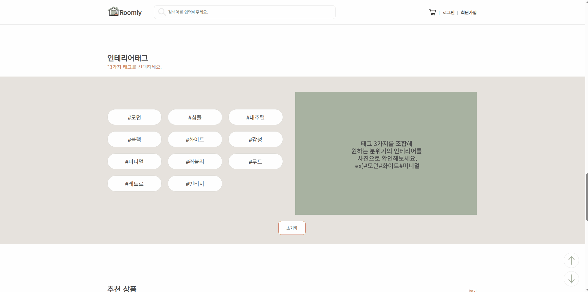
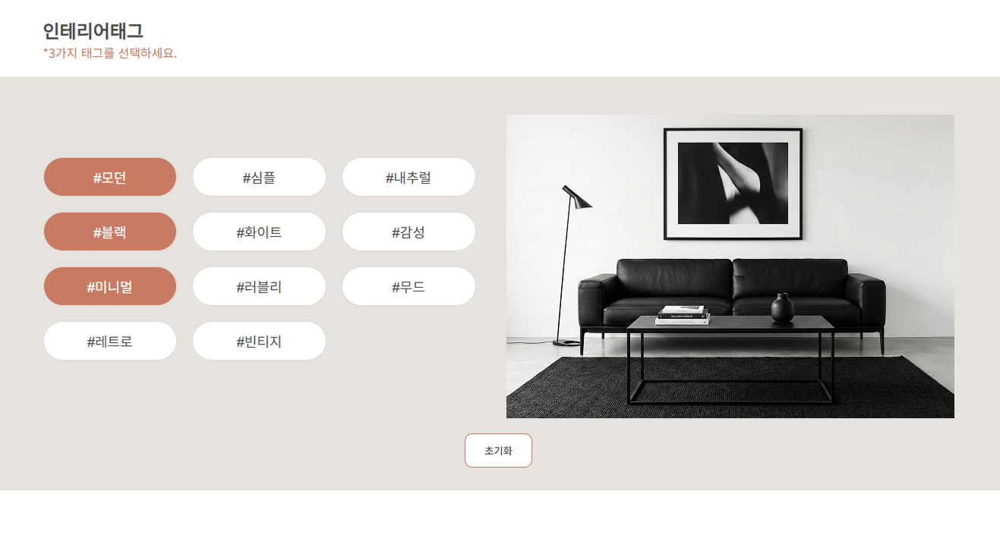

# 🏠 Roomly
인테리어에 대한 관심이 높아지고 있는 트렌드를 반영하여, 가구를 쉽게 탐색하고 구매할 수 있는 가구 쇼핑몰을 제작했습니다.

## 프로젝트 기간
- 기획 2025.09.22 - 2025.10.14
- 설계 2025.10.15 - 2025.10.24
- 구현 2025.10.25 - 2026.12.09

## 🛠️ 기술스택
- JavaScript
- jQuery
- Scss
- Swiper

## 📌 주요기능
- 인테리어 태그 조합에 따른 이미지 동적 변경 기능 구현
- 상품 옵션 및 수량 선택에 따른 총 금액 실시간 계산
- JavaScript 기반 로그인 / 회원가입 기능 구현 (입력값 유효성 검사 포함)

## 🧠 설계 및 구현 과정
### 1. 인테리어 태그 조합 콘텐츠
#### 태그 조합 매칭 로직 설계
- 선택된 태그를 배열로 관리하고, 정렬 후 data-combo 값과 비교하여 조합 일치 여부를 판단
- 조건에 맞는 이미지만 class 제어 방식으로 노출하여 동적 화면 전환 구현
- 매칭 실패 시 기본 안내 이미지가 표시되도록 예외 처리 설계
#### 핫스팟 상품 정보 인터랙션 구현
- 핫스팟 상품 정보 인터랙션 구현
- offset 기반 위치 계산 및 fadeIn/out 효과 적용
- setTimeout과 clearTimeout을 활용해 사용자 경험을 고려한 인터랙션 처리

| 인테리어 태그 콘텐츠 |
| :--: |
|  |

#### main.js
> 선택된 태그를 정렬 후 조합 비교하여 일치 여부를 판단
```javascript
// 선택된 코드 정렬
const sortedTags = selectTags.slice().sort((a,b) => a-b);

// data-combo 조합과 비교
const isMatch = comboGroups.some(combo =>
  combo.length === sortedTags.length &&
  combo.every((v, i) => v === sortedTags[i])
);

// 조건부 생성으로 중복 방지
if(!productBox){
  productBox = $('<div class="product_box"></div>').appendTo('body');
}

// 인터랙션 제어
hideTimer = setTimeout(() => {
  productBox.fadeOut(100);
}, 200);

clearTimeout(hideTimer);
```

#### 🔧 트러블슈팅: 사용자 탐색 경험 개선 (핫스팟 추가)
#### 개선 전
> 태그 버튼 클릭 시 해당 이미지가 변경되지만, 이미지 노출 후 추가적인 상호작용 요소가 없어 사용자가 기능의 목적을 직관적으로 이해하기 어려웠습니다.
정적인 UI 구조로 인해 탐색 흐름이 자연스럽게 이어지지 않는 문제가 있었습니다.

| 핫스팟 개선 전 |
| :--: |
|  |

#### 개선 후
> 이미지 내 상품 위치에 핫스팟을 추가하고 data-* 속성을 활용하여 상품 정보를 동적으로 바인딩하였습니다.
사용자가 마우스를 올리거나 클릭할 경우 상품 정보가 노출되도록 구현하여, 정적인 화면 구조를 인터랙티브 UI로 개선하였습니다.
이를 통해 사용자의 시각적 몰입도를 높이고, 상품 탐색 흐름이 자연스럽게 이어지도록 개선하였습니다.
```
<button class="hotspot"
    data-name="화이트 패브릭 소파"
    data-price="259,000원"
    data-thumb="./images/white_sofa01.png"
    style="top:70%; left:28%;">
</button>

$('.hotspot').on('mouseenter click', function(){
        const name = $(this).data('name');
        const price = $(this).data('price');
        const thumb = $(this).data('thumb');

        if(!productBox){
            productBox = $('<div class="product_box"></div>').appendTo('body');
        }

        productBox.html(`
            <a href="detail_page/detail_page.html">
                
                <div class="product_info">
                    <p>${name}</p>
                    <span>${price}</span>
                </div>
            </a>
        `).fadeIn(150);
  ...
};
```

### 2. 총 금액 실시간 계산
- 옵션 선택 및 수량 변경에 따라 총 결제 금액이 즉시 반영되도록 구현
- 수량 변경 시마다 재계산하여 UI에 즉시 반영

#### detail_page.js
```javascript
function updateTotalPrice() {
    let total = 0;

    $('.select_detail.select_detail_on').each(function () {
        const priceText = $(this).find('.select_price').text();
        const price = Number(priceText.replace(/[^0-9]/g, ''));
        total += price;
    });

    $('.total_price').text(formatPrice(total) + '원');
}
```

### 3. JavaScript 기반 로그인 / 회원가입 기능
- 아이디 포함 여부를 체크하여 보안성을 강화
- 정규식을 활용해 비밀번호 길이, 문자 조합 조건을 검증
- 동일 문자 반복 및 연속 문자 사용을 제한하여 안전성 확보
- 카카오 우편번호 API를 활용하여 주소 검색 기능 구현
- 사용자가 선택한 주소 타입에 따라 도로명/지번 주소를 분기 처리하여 입력 필드에 자동 반영

#### sign_up.js
```javascript
// 정규식을 활용한 비밀번호 검증
function requiredPw(pw, id) {
    const lengthCheck = /^.{10,16}$/; 
    const hasLetter = /[A-Za-z]/.test(pw);
    const hasNumber = /[0-9]/.test(pw);
    const hasSpecial = /[~`!@#$%^()*_\-={}[\]|:;<>,.?/]/.test(pw);

    const typeCount = [hasLetter, hasNumber, hasSpecial].filter(v => v).length;

    if (!lengthCheck.test(pw)) return false;
    if (typeCount < 2) return false;
    if (pw.includes(' ')) return false;
    if (id && pw.includes(id)) return false;

    return true;
}

// 카카오 우편번호 API 연동
function sample6_execDaumPostcode() {
    new daum.Postcode({
        oncomplete: function(data) {
            let addr = '';

            if (data.userSelectedType === 'R') {
                addr = data.roadAddress;
            } else {
                addr = data.jibunAddress;
            }

            document.getElementById('sample6_postcode').value = data.zonecode;
            document.getElementById("sample6_address").value = addr;
            document.getElementById("sample6_detailAddress").focus();
        }
    }).open();
}
```

### ✨ 프로젝트를 통해
처음 만드는 자사 사이트이다 보니 기획과 설계 단계에서 많은 시간이 필요했고, 전체적인 구조를 잡아가는 과정도 쉽지 않았습니다. 하지만 그만큼 프로젝트 전반에 대해 깊이 고민해볼 수 있었고, 개발자로서 한 단계 성장할 수 있는 계기가 되었습니다.

특히 JavaScript 기반의 동적 UI 처리와 이벤트 제어, 정규식을 활용한 유효성 검사, 외부 API 연동 등을 직접 구현해보며 사용자 중심의 인터랙션을 설계하는 역량을 키울 수 있었습니다. 단순히 기능을 구현하는 데 그치지 않고, 사용자의 흐름을 고려해 더 자연스럽고 직관적인 화면을 만들기 위해 고민했던 경험이 인상 깊게 남습니다.
